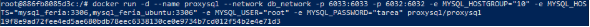

No permite hacer pull pero la red esta bien

Configurar dns manualmente

Pull exitoso 

Instancianciar la imagen mysql:latest

Entrar a mysql

creamos todas nuestras tablas

verificar que todas las tablas se hayan creado correctamente

creamos nuestro sp para los 1000 inserts por tabla

Seguido de esto lo ejecutamos 

Luego de esto lo primero que tenemos que hacer es crear los schemas y asignarle las tablas

Creamos los usuarios y asignamos privilegios

Ejecutamos un contenedor de Ubuntu, así no tengamos la imagen la descargara y le hará la instancia, velamos para que el id del grupo de Linux sea 0. Actualizamos descargamos docker

Duplicamos el volumen de nuestra anterior base de datos feria

Luego ejecutamos el contenedor de mysql dentro de Ubuntu con nuestro volumen duplicado

Comprobamos que el volumen se haya duplicado y asignado correctamente y listo

iniciamos el contenedor de mysql dentro de linux

Salimos de linux y volvemos a entrar con docker attach

Ejecutamos el demonio de mysql

![Interfaz de usuario gráfica, Texto, Aplicación

El contenido generado por IA puede ser incorrecto.]

Escribimos mysql

![Interfaz de usuario gráfica, Texto, Aplicación

El contenido generado por IA puede ser incorrecto.]

Salimos de mysql para ejecutar la instalación segura a lo que todo le vamos a dar y

Ejecutamos mysql de nuevo como somos el usuario root de Linux mysql asume que tenemos permiso por lo que en contraseña podemos digitar cualquier cosa

Añadimos todos los contenedores a un network para que el proxysql pueda manejarlos

En PowerShell: 

1\. Crear una red de puente (bridge)

docker network create db\_network

2\. Conectar tu contenedor ubuntu\_docker (donde está el cliente) a la nueva red

docker network connect db\_network ubuntu\_docker

3\. Conectar tu contenedor mysql\_feria (el servidor original) a la nueva red

docker network connect db\_network mysql\_feria

4\. Conectar el otro servidor MySQL (mysql\_feria\_ubuntu) a la nueva red

docker network connect db\_network mysql\_feria\_ubuntu

Instalamos el contenedor de el manejador de conexión proxy (obviamente añadiéndolo al bridge)

configuramos el proxy desde el contenedor de proxysql como admin para apoderarnos de los dos contenedores

salimos hasta el contenedor de Linux iniciamos una nueva conexión del usuario root utilizando proxy verificamos que todo sirva y listo

CONTINUAMOS CON SQLSERVER

Instalamos el contenedor de sqlserver con volumen y de una ves lo añadimos a el network

Ingresamos al contenedor

\
salimos de ahí y empezamos a instalar dependencias de sqlserver

Después de instalar todas las dependencias y herramientas ejecutamos sqlserver de forma interactiva y ejecutamos sqlcmd de forma correcta (con la ruta)

Lo siguiente es ingresar todo el código de nuestra base de datos

Procedure con los 1000 inserts por tabla

Creamos los schemas, los logins y usuarios correctamente

Ahora necesitamos duplicar el volumen de nuestro contenedor del host para tener todo lo que hemos hecho en el contenedor del motor que esta dentro de Ubuntu 

Primeramente apagamos el contenedor al que le deseamos duplicar el volumen

Luego duplicamos el volumen

Por ultimo encendemos Ubuntu y atacamos para así crear nuestro contenedor en Ubuntu

Se nos va a presentar el siguiente error

Con este comando le damos permisos al volumen para forzar que la carpeta de datos del volumen (/var/opt/mssql) sea propiedad del usuario 10001 (el UID de mssql). Ahora nuestro contenedor debería permanecer activo

Instalar gnupg y wget

A pesar de todo un día de esfuerzo me fue imposible instalar sqlserver en el os de Linux Ubuntu, prosigo con postgresql

Ahora vamos a ejecutar el contenedor de postgresql de windows

Ingresamos al contenedor

Creamos nuestras tablas

Creamos la función

Y la llamamos y verificamos

Creamos schemas pasamos tablas

Y creamos usuarios dándole los respectivos permisos

Cremos nuevo volumen donde vamos a duplicar este volumen

![ref1]

Pasamos lo datos

Creamos el contenedor postgresql dentro de Ubuntu con el volumen que duplicamos

Actualizamos las listas de paquetes

Instalamos postgresql

Añadimos con éxito el usuario postgres

Añadimos carpetas necesarias para archivos internos

PostgreSQL no podía arrancar porque faltaba /var/run/postgresql/, así que la añadimos

Ingresamos como usuario postgres y arrancamos el motor manualmente

Entramos a postgresql 

Añadimos la extencion para adminitrar los dos contenedores desde el contenedor Ubuntu (el ps que esta nativo)

Creamos una network y añadimos los contendores a este

Ingresamos de nuevo a postgres nativo de Linux

Creamos los servidores y mapeamos los usuarios

Hacemos una prueba para ver si tenemos control de nuestros servidores y.. perfecto

Seguimos con mongodb

Creamos volumen y lo signamos al contenedor creado, mongo creara otro volumen pero es solo para su configuracion

Ejecutamos contenedor temporal para usar el cliente mongo

Creamos las coleccioes

Bucle para 1000 documentos

Verificamos los documentos por conexión

Creamos los “schemas”

Pasamos las colecciones a los “schemas”

Creamos usuarios

Comprobamos que los usuarios se hayan creado

Duplicamos el volumen

Creamos el contenedor utilizando el volumen que duplicamos añadiéndolo a la network de mongo

Dentramos al contenedor

Verificamos que el volumen se haya aplicado correctamente

La instalación de mongo en Linux se me complico un poco entro en un bucle y me toco cerrar la ventana pero por suerte funciono

Tenia el sistema dañado de tantos intentos para descargar sqlserver

dpkg --purge --force-all mssql-server

rm -rf /opt/mssql /var/opt/mssql

rm /etc/apt/sources.list.d/mssql-server.list

recupere paquetes dañados

echo -e "Package: base-files\nStatus: install ok installed\nPriority: required\nSection: admin\nInstalled-Size: 0\nMaintainer: Ubuntu Developers <ubuntu-devel-discuss@lists.ubuntu.com>\nArchitecture: amd64\nVersion: 1\nDescription: Minimal dpkg status file to recover apt" > /var/lib/dpkg/status

apt-get update

configuración para el repositorio de mongo

curl -fsSL https://pgp.mongodb.com/server-6.0.asc | gpg --dearmor -o /usr/share/keyrings/mongodb-server-6.0.gpg

echo "deb [signed-by=/usr/share/keyrings/mongodb-server-6.0.gpg] https://repo.mongodb.org/apt/ubuntu focal/mongodb-org/6.0 multiverse" > /etc/apt/sources.list.d/mongodb-org-6.0.list

apt-get update

arregle dependencias rotas

wget https://launchpad.net/ubuntu/+archive/primary/+files/libssl1.1\_1.1.1f-1ubuntu2.24\_amd64.deb

dpkg -i libssl1.1\_1.1.1f-1ubuntu2.24\_amd64.deb

arranque manual (aquí entro en bucle)

mkdir -p /data/db

mongod --dbpath /data/db

Y finalmente

COMANDOS UTILIZADOS

Docker images: visualizar las imágenes instaladas

docker pull: descargar imagen

docker run --name mysql-feria -e MYSQL\_ROOT\_PASSWORD=feria -e MYSQL\_DATABASE=feria -p 3306:3306 -d mysql:latest: comando para instanciar la imagen y generar el contenedor de mysql

docker run: instanciar imagen, echar a correr el contrenedor

--name mysql-feria: asignarle nombre del contenedor\
-e MYSQL\_ROOT\_PASSWORD=feria: contraseña de usuario root\
-e MYSQL\_DATABASE=feria: creación de la base de datos feria                                                                    -p 3306:3306: asignar puerto\
-d mysql:latest: imagen instanciada, y dando la orden para que se ejecute el contenedor en segundo plano "detached" con -d 

show tables: muestra todas las tablas

docker attach Ubuntu\_docker: entrar a la terminal de Linux obviamente primero hay que iniciarlo

docker start: inicializar contenedores.\
**-i (interactive):** Mantiene la entrada estándar abierta, lo que permite interactuar con la terminal.

**-t (tty):** Asigna una pseudo-TTY (terminal), lo que hace que la experiencia de la *shell* sea funcional.

Comando para descargar sqlserver en el os de Ubuntu

apt update && apt install -y gnupg wget

apt update && apt install -y curl apt-transport-https && curl https://packages.microsoft.com/keys/microsoft.asc | apt-key add - && add-apt-repository "$(wget -qO- https://packages.microsoft.com/config/ubuntu/20.04/mssql-server-2019.list)" && apt update && apt install -y mssql-server

actualizamos paquetes e instalamos postgres

apt update

apt install -y postgresql postgresql-contrib

añadir usuario postgresql

useradd -m -s /bin/bash postgres

preparamos directorios:

mkdir -p /var/lib/postgresql/data

chown -R postgres:postgres /var/lib/postgresql

mkdir -p /var/run/postgresql

chown postgres:postgres /var/run/postgresql

arrancamos motor manualmente(debemos conocer la version de nuestro postgresql 

ls /usr/lib/postgresql/):

/usr/lib/postgresql/16/bin/pg\_ctl -D /var/lib/postgresql/data -l logfile start

Ingresamos a postgres:

Psql

Cremos nuevo volumen

![ref1]

Duplicamos voplumen

docker run --rm -v pgdata\_feria:/from -v $(pwd)/pgdata\_feria\_ubuntu:/to alpine sh -c "cp -a /from/. /to/"

duplicamos volumen de mongo

docker run --rm -v mongo\_feria\_data:/from -v mongo\_feria\_data\_ubuntu:/to alpine ash -c "cd /from && cp -a . /to"

descargar mongo en Linux ubuntu

apt-get update && apt-get install -y gnupg curl && curl -fsSL https://pgp.mongodb.com/server-6.0.asc | gpg --dearmor -o /usr/share/keyrings/mongodb-server-6.0.gpg && echo "deb [ signed-by=/usr/share/keyrings/mongodb-server-6.0.gpg ] https://repo.mongodb.org/apt/ubuntu focal/mongodb-org/6.0 multiverse" | tee /etc/apt/sources.list.d/mongodb-org-6.0.list && apt-get update && apt-get install -y mongodb-org

GLOSARIO

DNS

[Interfaz de usuario gráfica, Texto, Aplicación

El contenido generado por IA puede ser incorrecto.]: Aspose.Words.362da40b-88e2-4876-89cb-1e7beabc4318.019.png
[Interfaz de usuario gráfica, Texto, Aplicación

El contenido generado por IA puede ser incorrecto.]: Aspose.Words.362da40b-88e2-4876-89cb-1e7beabc4318.020.png
[ref1]: Aspose.Words.362da40b-88e2-4876-89cb-1e7beabc4318.050.png
