## Documentación Técnica de Implementación de Bases de Datos (SQL y NoSQL) en Entornos Híbridos (Windows & Ubuntu) con Docker

---

### Descripción del Documento

Este documento detalla el **proceso de instalación, configuración y gestión inicial** de múltiples sistemas de gestión de bases de datos, tanto **SQL** (MySQL, SQL Server, PostgreSQL) como **NoSQL** (MongoDB), en diferentes entornos operativos (**Windows** y **Ubuntu OS**) y bajo el paradigma de **contenedores Docker (incluyendo Docker-in-Docker - DIND)**.

Se cubren los pasos para el aprovisionamiento de imágenes, la creación de bases de datos y tablas/colecciones, la implementación de lógica de inserción masiva (1000 registros por tabla/colección), la configuración de **Schemas y gestión de usuarios/permisos**, asegurando un despliegue seguro y estructurado.

## 📋 Índice de Contenido

---

### Introducción
* Descripción del Documento

### 💾 WINDOWS OS: Despliegue en Contenedores

1.  **🗄️ WINDOWS MYSQL**
    * 1. Diagnóstico y Solución de Conectividad (Pull de Imagen)
    * 2. Despliegue del Contenedor MySQL
    * 3. Configuración y Población de la Base de Datos
    * 4. Seguridad y Gestión de Acceso
2.  **☁️ WINDOWS SQLSERVER**
    * 1. Despliegue del Contenedor e Instalación de Herramientas
    * 2. Creación y Población de la Base de Datos
    * 3. Seguridad y Gestión de Acceso
3.  **🐘 WINDOWS POSTGRESQL**
    * 1. Inicialización y Acceso al Contenedor
    * 2. Creación de Estructuras y Población de Datos
    * 3. Seguridad y Gestión de Acceso
4.  **🟢 WINDOWS MONGO**
    * 1. Configuración de Colecciones y Población de Datos
    * 2. Seguridad y Gestión de Acceso

### 🐧 UBUNTU OS: Despliegue Nativo

1.  **☁️ OS UBUNTU SQLSERVER**
    * 1. Preparación del Contenedor Base Ubuntu
    * 2. Instalación y Configuración del Servidor SQL
    * 3. Instalación de Herramientas Cliente y Acceso
    * 4. Configuración y Población de la Base de Datos
    * 5. Seguridad y Gestión de Acceso
2.  **🐬 UBUNTU MYSQL**
    * 1. Instalación y Ejecución del Servicio
    * 2. Creación de Estructuras y Población de Datos
    * 3. Seguridad y Conectividad
3.  **🍃 OS UBUNTU MONGO**
    * 1. Instalación y Ejecución del Servicio
    * 2. Creación y Población de la Base de Datos
    * 3. Seguridad y Gestión de Acceso
4.  **🐘 OS UBUNTU POSTGRES**
    * 1. Instalación y Preparación Inicial
    * 2. Estructura y Población de Datos
    * 3. Seguridad, Usuarios y Configuración de Red

### ⚙️ DOCKER IN DOCKER (DIND) - Aislamiento Anidado

1.  **Configuración del Contenedor Anfitrión DinD**
2.  **🐘 DIND POSTGRESQL**
    * Despliegue de Contenedor PostgreSQL (Dentro de DinD)
3.  **☁️ DIND SQLSERVER**
    * Despliegue de Contenedor SQL Server (Dentro de DinD)
4.  **🍃 DIND MONGO**
    * Despliegue y Configuración de MongoDB (Dentro de DinD)
5.  **🐬 DIND MYSQL**
    * Despliegue y Configuración de MySQL (Dentro de DinD)

### 📄 Conclusión

---
## WINDOWS MYSQL - Despliegue y Configuración Inicial

---

### 1. Diagnóstico y Solución de Conectividad (Pull de Imagen)

* **Problema Inicial (Fallo en Pull):** El sistema inicialmente no permitía realizar la operación `docker pull` de   la imagen de MySQL, a pesar de tener una conexión de red funcional.
    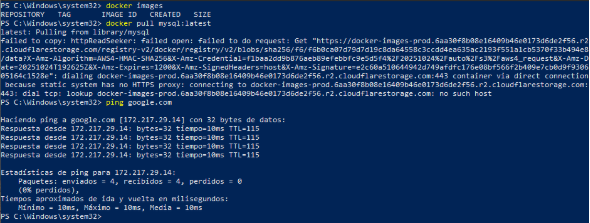
  

* **Solución Aplicada:** Se procedió a **configurar el DNS de forma manual** en el entorno,   resolviendo el problema de conectividad del servicio Docker.
    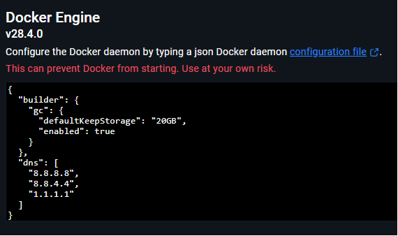

* **Resultado:** **Pull exitoso** de la imagen.  
    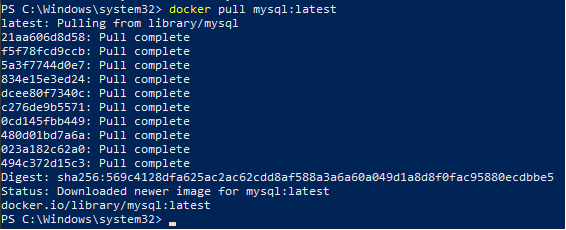

---

### 2. Despliegue del Contenedor MySQL

* **Instanciación de la Imagen:** Se instanció la imagen `mysql:latest`, creando el contenedor para la base de datos.
    

* **Verificación de Contenedor:** Se confirma que el contenedor está corriendo correctamente.
    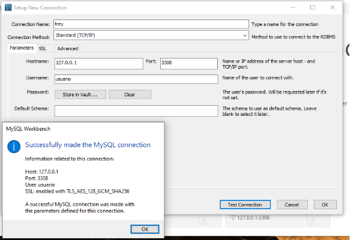

* **Acceso a MySQL:** Ingreso a la consola del servidor MySQL dentro del contenedor.
    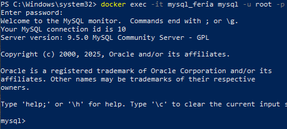

---

### 3. Configuración y Población de la Base de Datos

* **Creación de Tablas:** Se crearon todas las estructuras de tablas necesarias para el proyecto.
    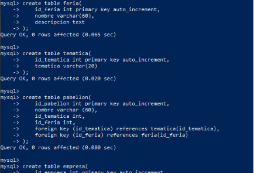
    
    *Verificación de que todas las tablas se hayan creado correctamente.*

* **Creación del Stored Procedure (SP):** Se definió un *Stored Procedure* para la inserción masiva de
  **1000 registros** por tabla.
    

* **Ejecución del SP:** Ejecución del *Stored Procedure* para poblar las tablas.  
    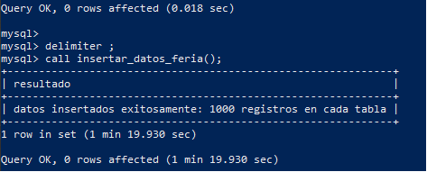

---

### 4. Seguridad y Gestión de Acceso

* **Creación y Asignación de Schemas:** Se crearon los **schemas** (esquemas) necesarios y   se asignaron las tablas correspondientes a cada uno.  
    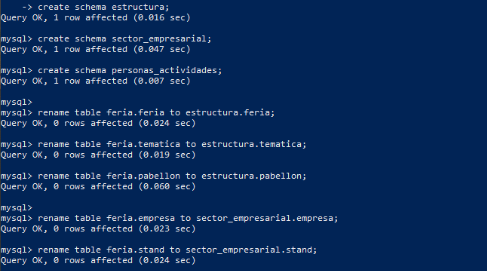

* **Creación de Usuarios y Privilegios:** Se definieron los **usuarios** de la base de datos y se les asignaron los **privilegios** (permisos) necesarios para su operación.  
    

## WINDOWS SQLSERVER - Despliegue y Configuración

---

### 1. Despliegue del Contenedor e Instalación de Herramientas

* **Instalación del Contenedor:** Se procedió a instalar y levantar el contenedor de SQL Server en el entorno Windows.
    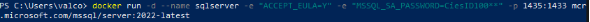

* **Acceso al Contenedor:** Ingreso inicial al *shell* del contenedor para la configuración interna.
    

* **Instalación de Dependencias:** Se salió del contenedor para comenzar la instalación de las dependencias y herramientas
   necesarias para SQL Server y la consola `sqlcmd` (utilizando múltiples comandos de instalación y configuración).
    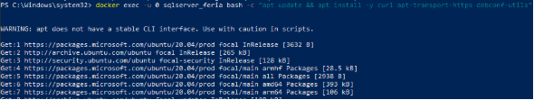
    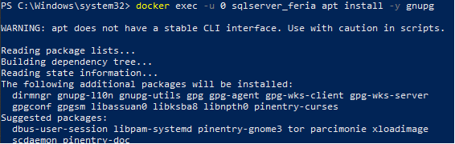
    
    
    
    

* **Ejecución y Acceso:** Tras completar las instalaciones, se ejecuta SQL Server de forma interactiva y se logra acceder a la utilidad `sqlcmd` usando la ruta correcta.  
    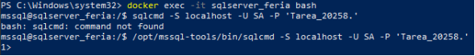

---

### 2. Creación y Población de la Base de Datos

* **Ingreso del Código DDL/DML:** Se procede a ingresar todo el código necesario para la creación de la estructura de la base de datos (tablas, índices, etc.).  
    

* **Procedure de Inserción Masiva:** Creación del *Stored Procedure* encargado de generar e insertar **1000 registros** por tabla.
    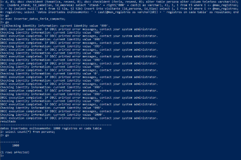

---

### 3. Seguridad y Gestión de Acceso

* **Creación de Schemas, Logins y Usuarios:** Se establecen los **Schemas**, se crean los **Logins** de acceso al servidor y se asignan los **Usuarios** a la base de datos con los permisos adecuados.  
    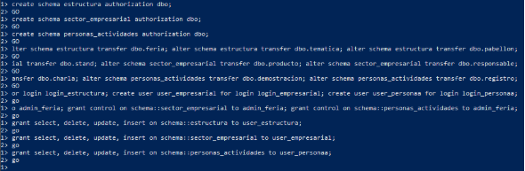
    

## WINDOWS POSTGRESQL - Despliegue y Configuración

---

### 1. Inicialización y Acceso al Contenedor

* **Ejecución del Contenedor:** Se ejecutó el contenedor de PostgreSQL en el entorno de Windows.
    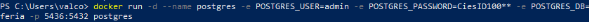

* **Ingreso al Contenedor:** Acceso al *shell* del contenedor para iniciar la configuración de la base de datos.
    

---

### 2. Creación de Estructuras y Población de Datos

* **Creación de Tablas:** Se procedió a definir y crear todas las tablas de la base de datos en PostgreSQL.
    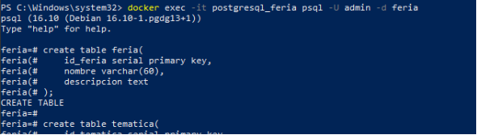

* **Creación de la Función de Inserción:** Se creó una **función** (equivalente a un *Stored Procedure* en otros SGBD) para la inserción masiva de datos (1000 registros).  
    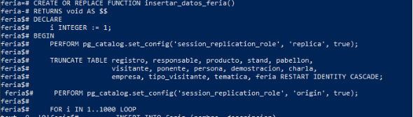

* **Ejecución y Verificación:** La función fue invocada (llamada) y se verificó que la inserción de datos se haya realizado correctamente.
    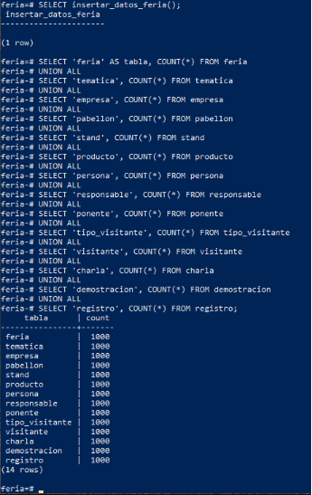

---

### 3. Seguridad y Gestión de Acceso

* **Creación de Schemas y Asignación de Tablas:** Se crearon los **schemas** lógicos y se asignaron las tablas previamente creadas a estos nuevos esquemas.  
    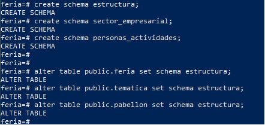

* **Creación de Usuarios y Permisos:** Se definieron los usuarios necesarios y se les otorgaron los **respectivos permisos** (privilegios) para interactuar con los schemas y las tablas.  
    

* **Validación Adicional de Entorno:**  
    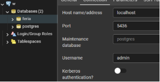

## WINDOWS MONGO - Despliegue y Configuración NoSQL

---

### 1. Configuración de Colecciones y Población de Datos

* **Creación de Colecciones:** Se inició el entorno de MongoDB y se crearon las colecciones (equivalentes a tablas) necesarias para el proyecto.
    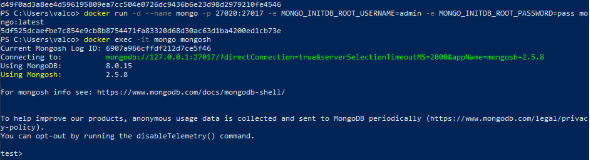
    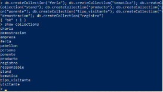

* **Bucle de Inserción Masiva:** Implementación de un bucle de inserción para añadir **1000 documentos** por colección.
    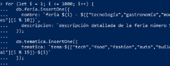

* **Verificación de Inserción:** Comprobación del número de documentos creados para confirmar la inserción masiva.  
    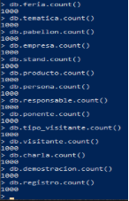

---

### 2. Seguridad y Gestión de Acceso

* **Creación de "Schemas" (Roles/Permisos Lógicos):** Creación de estructuras lógicas de gestión (similares a *schemas* en bases de datos relacionales) para organizar la base de datos NoSQL.  
    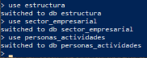

* **Asignación de Colecciones:** Las colecciones creadas se transfirieron o asociaron a estas nuevas estructuras lógicas.
    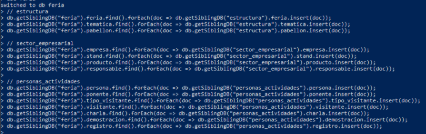

* **Creación de Usuarios:** Creación de usuarios de la base de datos con roles definidos.  
    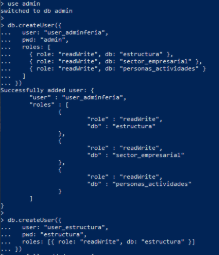

* **Comprobación de Usuarios:** Verificación final de la creación y configuración correcta de los usuarios.
    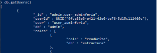
    

---

## UBUNTU OS - Despliegue de Entornos

---

### 1. Preparación del Contenedor Base Ubuntu

* **Ejecución del Contenedor:** Se ejecutó el contenedor base de Ubuntu, exponiendo todos los puertos que serían utilizados por los diferentes servicios de bases de datos para evitar conflictos.
    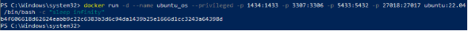

---

## OS UBUNTU SQLSERVER - Instalación Nativa

---

### 2. Instalación y Configuración del Servidor SQL

* **Instalación de Dependencias y Repositorios:** Se instalaron las dependencias necesarias y se configuraron los repositorios de Microsoft para comenzar la descarga de SQL Server.  
    

* **Instalación de `mssql-server`:** Se instaló el paquete principal de SQL Server.  
    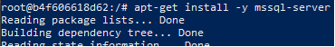

* **Configuración Inicial:** Se configuró el área geográfica y la zona horaria del sistema.
    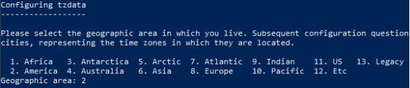
    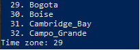

* **Configuración del Producto:** Se respondió `yes` a las preguntas de configuración y se seleccionó la **edición Developer**.
    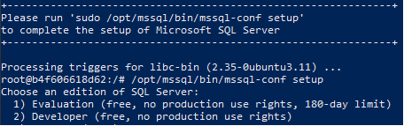

* **Configuración de Contraseña:** Se estableció la contraseña para el usuario `SA`.
    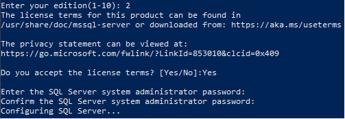

* **Verificación de Servicio:** Se ejecutaron los logs y, al finalizar, se verificó el estado de los servicios con el comando correspondiente.
    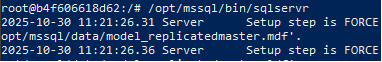
    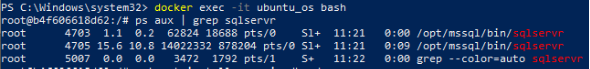

### 3. Instalación de Herramientas Cliente y Acceso

* **Instalación de ODBC y Herramientas:** Se instalaron las librerías y herramientas de **ODBC** (Open Database Connectivity).
    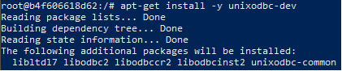

* **Acceso a `sqlcmd` (Consola Cliente):** Se aceptó la configuración y se accedió a la consola `sqlcmd`.
    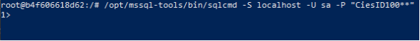

* **Desbloqueo de Herramienta:** Se salió y se volvió a ejecutar la consola para el paso final de desbloqueo/inicialización.
    

---

## UBUNTU MYSQL - Instalación Nativa y Configuración

---

### 1. Instalación y Ejecución del Servicio

* **Descarga de MySQL:** Se ejecutaron los comandos necesarios para la descarga e instalación del servidor MySQL en el sistema operativo Ubuntu.
    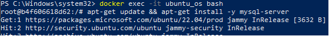

* **Ejecución del Servicio:** Se inició el servicio de MySQL.
    

* **Verificación de Estado:** Se comprobó que el servicio de MySQL estuviera corriendo activamente.
    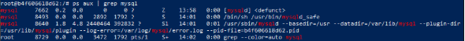

* **Acceso a la Consola:** Ejecución del cliente MySQL para acceder a la base de datos.
    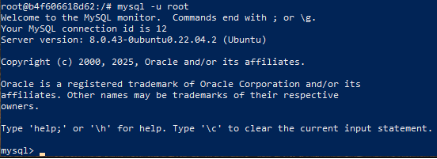

---

### 2. Creación de Estructuras y Población de Datos

* **Creación de DB y Tablas:** Se creó la base de datos y todas sus tablas dentro del entorno MySQL.
    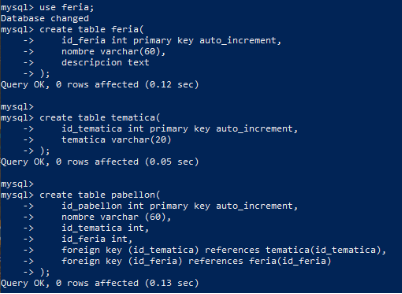

* **Creación y Ejecución del Procedure:**
    * Se definió el **Stored Procedure** para la inserción masiva de **1000 registros**.  
        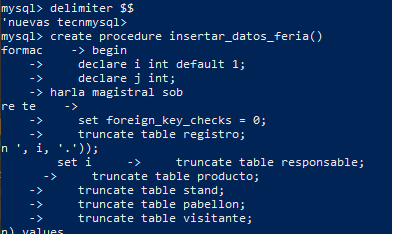
    * Se ejecutó el *Procedure* para poblar las tablas.  
        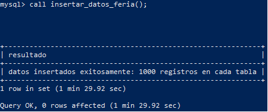

---

### 3. Seguridad y Conectividad

* **Creación de Schemas y Asignación de Tablas:** Se crearon los **schemas** lógicos y se procedió a mover o asignar las tablas a estos nuevos esquemas.  
    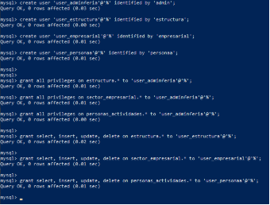

* **Creación de Usuarios y Permisos:** Se definieron los usuarios y se les otorgaron los **privilegios** necesarios para interactuar con la base de datos.  
    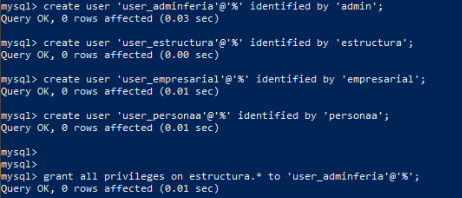

* **Prueba de Conexión:** Se verificó la conectividad con la base de datos recién configurada.  
    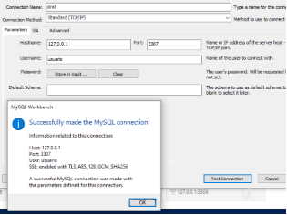

---

## OS UBUNTU MONGO - Instalación Nativa y Configuración NoSQL

---

### 1. Instalación y Ejecución del Servicio

* **Agregar Clave GPG:** Se añadió la clave GPG (GNU Privacy Guard) de MongoDB para verificar la autenticidad de los paquetes.
    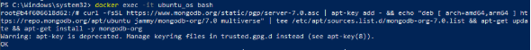

* **Añadir Repositorio:** Se configuró el repositorio de MongoDB para la versión de Ubuntu utilizada.
    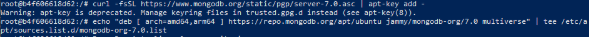

* **Actualización de Directorios:** Se actualizaron los índices de paquetes del sistema operativo.
    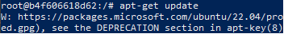

* **Descarga e Inicio del Servicio:** Se descargó el servidor MongoDB y se intentó iniciar el servicio.
    

* **Verificación y Acceso:** En una consola separada, se verificó el estado de ejecución del servicio y se accedió al cliente `mongo` (o `mongosh`).
    

---

### 2. Creación y Población de la Base de Datos

* **Uso de la Base de Datos y Colecciones:** Se seleccionó la base de datos **"feria"**, se crearon las colecciones necesarias y se ejecutó el bucle de inserción masiva para poblar la base de datos con **1000 documentos** por colección.
    

* **Verificación de Inserciones:** Se realizaron múltiples comprobaciones del número de documentos insertados en cada colección.
      
      
      
      
      

---

### 3. Seguridad y Gestión de Acceso

* **Creación de Estructuras Lógicas y Asignación:** Se crearon estructuras de gestión (referidas como "schemas" en el contexto de organización) y se asociaron las colecciones.  
    

* **Creación de Usuarios y Permisos:** Se definieron los **usuarios** y se asignaron los **roles/permisos** correspondientes.
    
    

---

## OS UBUNTU POSTGRES - Instalación Nativa y Configuración

---

### 1. Instalación y Preparación Inicial

* **Actualización y Descarga:** Se actualizaron los directorios de paquetes y se procedió a la descarga e instalación de PostgreSQL en Ubuntu.
    

* **Creación de Directorios:** Se crearon los directorios necesarios para la configuración y almacenamiento de datos de PostgreSQL.
    
    

* **Inicialización y Acceso:**
    * Se inicializó el servicio de PostgreSQL.  
        
    * Se ingresó a la consola `psql` para la gestión de la base de datos.  
        

---

### 2. Estructura y Población de Datos

* **Creación de DB y Tablas:** Se creó la base de datos de trabajo y todas las tablas del proyecto.
    
    

* **Función de Inserción Masiva:** Se creó la **función PL/pgSQL** encargada de la inserción de **1000 registros** por tabla.  
    

* **Ejecución y Verificación:** Se ejecutó la función de inserción y se verificó el recuento de datos.  
    

---

### 3. Seguridad, Usuarios y Configuración de Red

* **Creación de Schemas, Usuarios y Permisos:** Se crearon los **schemas**, se definieron los **usuarios** y se asignaron los **privilegios** (permisos) correspondientes para la gestión de acceso.  
      
      
      

* **Instalación de Utilidades:** Se ejecutaron comandos para actualizar e instalar la herramienta de edición de texto **nano**.
    

* **Modificación de Configuración de Red:**
    * Se procedió a **modificar el puerto y el `listen_addresses`** para permitir la conectividad externa.
        
        
    * Se detuvo y se volvió a iniciar el servicio para aplicar los cambios de configuración.
        
        

---

## DOCKER IN DOCKER (DIND) - Aislamiento Anidado

---

### 1. Configuración del Contenedor Anfitrión DinD

* **Ejecución del Contenedor Privilegiado:** Se ejecutó el contenedor base (anfitrión) con la *flag* `--privileged`, la cual es esencial para permitir que el *daemon* de Docker se ejecute dentro de él.
    

* **Instalación de Docker:** Se actualizaron los paquetes y se instaló la utilidad de Docker dentro del contenedor anfitrión.
    

* **Ejecución del Daemon:** Se inició el proceso del *daemon* de Docker (`dockerd`) para que el contenedor anfitrión pueda gestionar sus propios contenedores internos.  
    

---

## DIND POSTGRESQL - Despliegue Anidado

### 2. Despliegue de Contenedor PostgreSQL (Dentro de DinD)

* **Ejecución del Contenedor PostgreSQL:** Desde el entorno DinD, se ejecutó el contenedor de PostgreSQL.
    

* **Configuración de DB y Población:**
    * Se creó la base de datos y las tablas.  
        
        
    * Se creó la función de inserción masiva.  
        
    * Se ejecutó la función.  
        

* **Seguridad y Gestión:**
    * Creación de **schemas**.  
        
    * Creación de usuarios y asignación de permisos.  
        

---

## DIND SQLSERVER - Despliegue Anidado

### 3. Despliegue de Contenedor SQL Server (Dentro de DinD)

* **Creación del Contenedor SQL Server:** Se procedió a la creación y ejecución del contenedor de SQL Server dentro del entorno DinD.
    

* **Acceso y Configuración:**
    * Se ejecutó el contenedor y se accedió a la consola `sqlcmd`.
        
    * Creación de tablas.  
        
    * Creación del *Stored Procedure* de inserción.  
        
    * Ejecución del *Procedure* (1000 inserts).  
        

* **Seguridad y Gestión:**
    * Creación de **schemas**.  
        
    * Creación de logins, usuarios y asignación de permisos.  
        

---

## DIND MONGO - Despliegue NoSQL Anidado

---

### 1. Despliegue y Configuración de MongoDB (Dentro de DinD)

* **Ejecución del Contenedor:** Se procedió a ejecutar el contenedor de MongoDB dentro del entorno DinD.
    

* **Creación de Colecciones y Población:**
    * Creación de colecciones para la base de datos.  
        
    * Implementación del bucle de inserción de **1000 documentos** por colección.  
        
    * Verificación de la población de datos.  
        

* **Seguridad y Gestión:**
    * Creación de estructuras lógicas de organización ("schemas").  
        
    * Creación de usuarios y asignación de permisos/roles.  
        

---

## DIND MYSQL - Despliegue Relacional Anidado

---

### 2. Despliegue y Configuración de MySQL (Dentro de DinD)

* **Creación del Contenedor MySQL:** Se ejecutó el contenedor de MySQL dentro del entorno Docker anidado. 
    

* **Acceso y Creación de Tablas:**
    * Se ingresó a la consola del contenedor.  
        
    * Creación de la base de datos y sus tablas.  
        

* **Población de Datos:**
    * Creación del **Stored Procedure** de inserción masiva.  
        
    * Ejecución del *Procedure* para insertar **1000 registros** por tabla.  
        

* **Seguridad y Gestión:**
    * Creación de **schemas** y asignación de tablas.  
        
    * Creación de usuarios y asignación de privilegios.  
        
    * Verificación final de la configuración.  
        

---
    
* **FIN**
    

---

### 💻 Comandos de Referencia

---

Esta sección recopila los comandos clave utilizados durante el despliegue de las diferentes bases de datos y la configuración de los entornos Docker y Ubuntu.

#### **I. Comandos Generales de Sistema y Docker**

| Función | Comando de Ejemplo | Entorno |
| :--- | :--- | :--- |
| **Ejecutar Contenedor (MySQL)** | `docker run -d --name mysql_win -e MYSQL_ROOT_PASSWORD=root -p 3306:3306 mysql:latest` | Windows |
| **Ejecutar Contenedor Privilegiado (DinD)** | `docker run --privileged ... ubuntu:latest` | Windows/Ubuntu |
| **Ingresar al Contenedor** | `docker exec -it [nombre_contenedor] bash` | Docker |
| **Instalar Paquetes/Dependencias** | `apt update && apt install [paquete]` | Ubuntu |
| **Verificar Estado de Servicios** | `systemctl status [servicio]` | Ubuntu |
| **Detener/Iniciar Servicio** | `service [servicio] stop/start` | Ubuntu |

#### **II. Comandos Específicos de Bases de Datos**

| SGBD | Acción | Comando de Ejemplo |
| :--- | :--- | :--- |
| **MySQL** | Acceso a Consola | `mysql -u root -p` |
| **SQL Server** | Acceso a Consola | `/opt/mssql-tools/bin/sqlcmd -S localhost -U SA -P [Password]` |
| **PostgreSQL** | Acceso a Consola | `psql -U postgres` |
| **MongoDB** | Acceso a Consola | `mongosh` o `mongo` |
| **SQL** | Creación de Usuario | `CREATE USER [usuario] IDENTIFIED BY '[clave]';` |
| **SQL** | Asignar Permisos | `GRANT ALL ON [tabla] TO [usuario];` |
| **MongoDB** | Creación de Usuario | `db.createUser({...})` |

---

### 📚 Glosario de Términos Clave

---

| Término | Definición en el Contexto del Documento |
| :--- | :--- |
| **Contenedor** | Unidad ejecutable de *software* que empaqueta código y todas sus dependencias para que la aplicación se ejecute de manera rápida y fiable en cualquier entorno informático. |
| **Docker-in-Docker (DinD)** | Práctica de ejecutar un *daemon* de Docker dentro de otro contenedor Docker. Se utiliza para escenarios de *testing* o aislamiento de compilación, requiriendo privilegios especiales (`--privileged`). |
| **SQL (Structured Query Language)** | Lenguaje utilizado para gestionar y manipular bases de datos relacionales (MySQL, SQL Server, PostgreSQL). |
| **NoSQL** | Categoría de bases de datos no relacionales (como MongoDB) que ofrecen esquemas flexibles, ideales para manejar grandes volúmenes de datos o datos no estructurados. |
| **Stored Procedure (SP)** | En SQL, una rutina (función o procedimiento) almacenada en la base de datos y que puede ser ejecutada con una sola llamada. Se usó para la inserción masiva. |
| **Schema** | Un contenedor lógico de objetos de base de datos (tablas, funciones, etc.) que permite organizar y segregar las estructuras, y es clave para la gestión de permisos. |
| **Logins/Usuarios** | El **Login** (SQL Server) o **Usuario** (MySQL/PostgreSQL) es la entidad que se autentica en el servidor para acceder a las bases de datos. |

